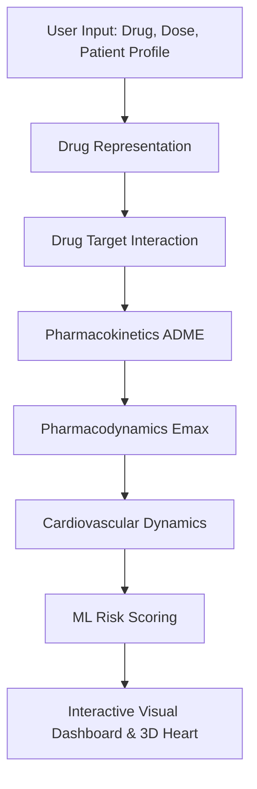

# Digital Twin Heart Prototype

An integrated medical AI demo platform combining a 7-layer drug–heart simulation engine, an activity-driven heart rate prediction model, live wearable metrics dashboarding, and a RAG medical assistant (MediRAG).

---

## Workspace Architecture

```
Digital Twin/
├── Unified/                  # Main integrated web application & baseline stack
│   ├── unified_app.py        # Central Flask application (Phases 1, 2, 3 integrated)
│   ├── app.py                # Standalone simulation web app
│   ├── feature_engine.py     # Natural language activity -> feature vector converter
│   ├── drug_vector.py        # SMILES generation & Morgan fingerprint generator
│   ├── heart-simulation.html # Anatomical heart animation iframe with canvas renderer
│   ├── simulation/           # 7-layer biophysical simulation engine
│   ├── static/ & templates/  # Dashboard HTML, CSS, and JS frontend
│   └── models/               # Pre-trained ML model artifacts (.joblib, .h5)
│
├── Phase 1/                  # Simulation engine standalone module
│   ├── app.py                # Flask simulation server
│   └── simulation/           # Pipeline, PK/PD, ECG, & Windkessel models
│
├── Phase 2/                  # Heart rate prediction & Telegram bot
│   ├── app2.py               # Telegram bot and heart rate prediction server
│   ├── tracker.py            # User interaction logger
│   ├── drugvector.py         # SMILES vector utility
│   └── config.json           # Baseline patient profile defaults
│
├── Phase 3/                  # RAG chatbot prototype
│   └── app.py                # Streamlit PDF/TXT document Q&A assistant
│
├── Dashboard.py              # Wearable API fetch utility
├── FetchAllMetrics.py        # Multi-metric polling daemon
├── Realtime.py               # Realtime watch polling script
└── requirements.txt          # Python dependencies
```

---

## 7-Layer Simulation Pipeline



1. **Drug Representation** ([`drug_representation.py`](file:///c:/Users/10a32/OneDrive/Desktop/Digital%20Twin/Phase%201/simulation/drug_representation.py)): Canonical SMILES & Morgan fingerprints.
2. **Target Interaction** ([`drug_target.py`](file:///c:/Users/10a32/OneDrive/Desktop/Digital%20Twin/Phase%201/simulation/drug_target.py)): Binding scores for hERG, $\text{Na}_{\text{v}}1.5$, $\text{Ca}_{\text{v}}1.2$, and $\beta_1$ receptors.
3. **Pharmacokinetics** ([`pharmacokinetics.py`](file:///c:/Users/10a32/OneDrive/Desktop/Digital%20Twin/Phase%201/simulation/pharmacokinetics.py)): ODE-based 1-compartment and 2-compartment ADME solvers (`scipy.integrate.solve_ivp`).
4. **Pharmacodynamics** ([`pharmacodynamics.py`](file:///c:/Users/10a32/OneDrive/Desktop/Digital%20Twin/Phase%201/simulation/pharmacodynamics.py)): Hill equation $E_{\text{max}}$ model with toxicity thresholding.
5. **Cardiovascular Model** ([`cardiovascular.py`](file:///c:/Users/10a32/OneDrive/Desktop/Digital%20Twin/Phase%201/simulation/cardiovascular.py)): Windkessel arterial pressure dynamics and synthetic ECG synthesis.
6. **Risk Predictions** ([`ml_predictions.py`](file:///c:/Users/10a32/OneDrive/Desktop/Digital%20Twin/Phase%201/simulation/ml_predictions.py)): Arrhythmia, cardiac event risk, and therapeutic index scoring.
7. **Visualization**: Real-time canvas heart contraction and multi-tab metric dashboards.

---

## Running the Applications

### 1. Unified Web Application (Recommended)
Runs all features (Drug Simulation, Heart Animation, Activity HR Predictor, MediRAG Chatbot) on a single port:

```bash
cd Unified
python unified_app.py
```
Open [http://127.0.0.1:8000](http://127.0.0.1:8000) in your browser.

### 2. Phase 2 Telegram Bot
Runs the activity heart-rate prediction bot:

```bash
cd "Phase 2"
python app2.py
```

### 3. Phase 3 MediRAG Streamlit App
Runs the document analysis chatbot UI:

```bash
cd "Phase 3"
streamlit run app.py
```

---

## Key API Endpoints

- `POST /api/simulate`: Runs 7-layer biophysical drug-heart simulation.
- `POST /api/chat-activity`: Predicts activity-based heart rate using Karvonen formula + ML models + Ollama.
- `GET /api/dashboard`: Serves sleep, $\text{SpO}_2$, and heart rate metrics from wearable integrations.
- `POST /api/rag/upload`: Ingests medical documents (PDF/TXT) into Chroma vector database.
- `POST /api/rag/chat`: Answers natural language queries over uploaded documents.

---

## Requirements

Install required dependencies:

```bash
pip install -r requirements.txt
```
