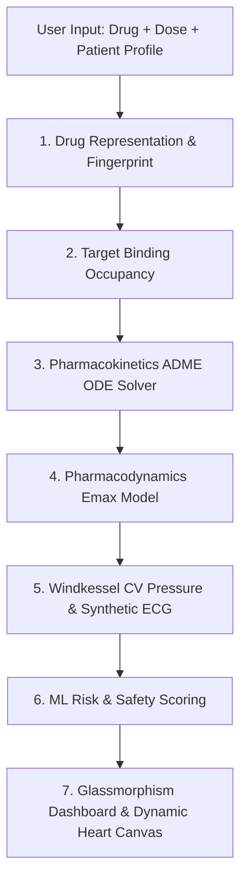

# 🫀 Digital Twin Heart (v2.0)

An integrated, multi-phase medical AI demo platform combining a **7-layer biophysical drug–heart simulation engine**, **polypharmacy combination modeling**, an **activity-driven heart rate prediction pipeline**, **live wearable metrics dashboarding**, and a **RAG-based medical document assistant (MediRAG)**.

---

## 🌟 Key Features

- **7-Layer Biophysical Simulation Engine**:
  - **L1 Drug Representation**: SMILES generation and Morgan molecular fingerprints.
  - **L2 Target Occupancy**: Dynamic binding models for $\text{hERG}$, $\text{Na}_{\text{v}}1.5$, $\text{Ca}_{\text{v}}1.2$, $\beta_1$, $\text{ACE}$, and $\text{AT}_1$.
  - **L3 Pharmacokinetics (ADME)**: ODE-based 1-compartment and 2-compartment clearance models (`scipy.integrate.solve_ivp`).
  - **L4 Pharmacodynamics**: Hill equation $E_{\text{max}}$ saturating effect models with toxicity thresholds.
  - **L5 Cardiovascular Model**: Arterial Windkessel pressure dynamics and synthetic 12-lead ECG synthesis.
  - **L6 ML Risk Assessment**: Arrhythmia risk, cardiac event probability, and therapeutic effectiveness scoring.
  - **L7 Digital Twin Visualization**: Interactive canvas heart contraction and safety score meters.
- **Polypharmacy & Combination Therapy**: Simulates additive ion channel blockade and synergistic arrhythmia risk when administering two drugs concurrently.
- **Patient Physiology Controls**: Customize patient eGFR (renal clearance), Serum Potassium ($\text{K}^+$ electrolyte sensitivity), and Baseline QTc.
- **Activity Heart Rate Predictor**: Trained ML ensemble (XGBoost, LightGBM, Random Forest, Keras LSTM with heteroscedastic loss) predicting heart rate response from natural language activity prompts.
- **MediRAG Document QA**: Persistent ChromaDB vector search with HuggingFace embeddings for PDF/TXT medical knowledge ingestion.
- **One-Click Simulation Export**: Download complete simulation data as a structured JSON report.

---

## 🏗️ Architecture & Execution Pipeline



---

## 🚀 Quick Start Guide (For Fresh Clones)

### Prerequisites
- **Python 3.9+** installed on your system.

### 1. Clone the Repository
```bash
git clone https://github.com/MSRAM-NEC/Digital-Twin.git
cd Digital-Twin
```

### 2. Install Dependencies
Install all required packages for simulation, web server, and machine learning models:
```bash
pip install -r requirements.txt
```

### 3. Environment Configuration (Optional)
Copy `.env.example` to `.env` if you wish to customize port or token defaults:
```bash
cp .env.example .env
```

### 4. Launch the Unified Web Application
Run the main web application containing all 4 interactive tabs (Drug Sim, Heart Viz, Activity HR, MediRAG):
```bash
cd Unified
python unified_app.py
```
Open your browser and navigate to: **[http://127.0.0.1:8000](http://127.0.0.1:8000)**

---

## 🦙 Ollama Setup Guide (For AI Insights & MediRAG Chat)

While the application operates using rule-based fallbacks if Ollama is not present, setting up **Ollama** enables local LLM AI insights and document Q&A via LLaMA 3.2.

### Step 1: Install Ollama
- **Windows / macOS**: Download and run the installer from **[ollama.com/download](https://ollama.com/download)**.
- **Linux**: Run the installation script in your terminal:
  ```bash
  curl -fsSL https://ollama.com/install.sh | sh
  ```

### Step 2: Download the LLaMA 3.2 Model
Open your terminal/command prompt and pull the `llama3.2` model:
```bash
ollama pull llama3.2
```

### Step 3: Verify Ollama is Running
Check that the Ollama service is active (runs automatically in background or via terminal):
```bash
ollama run llama3.2 "Hello"
```
The Digital Twin app will automatically connect to Ollama at `http://127.0.0.1:11434` for LLM generation.

---

## 📂 Repository Structure

```
Digital Twin/
├── Unified/                  # Main integrated web application stack
│   ├── unified_app.py        # Flask backend server
│   ├── feature_engine.py     # Natural language activity -> feature vector converter
│   ├── drug_vector.py        # SMILES generation & Morgan fingerprint generator
│   ├── heart-simulation.html # Anatomical heart canvas iframe renderer
│   ├── simulation/           # 7-layer biophysical simulation engine
│   ├── static/ & templates/  # Glassmorphism HTML, CSS, and JS frontend
│   ├── models/               # Pre-trained ML model artifacts (.joblib, .h5)
│   └── chroma_db/            # Persistent vector database for MediRAG
│
├── Phase 1/                  # Simulation engine standalone module
│   ├── app.py                # Standalone simulation Flask app
│   └── simulation/           # Biophysical pipeline modules
│
├── Phase 2/                  # Heart rate prediction & Telegram bot
│   ├── app2.py               # Telegram bot server
│   ├── tracker.py            # Interaction logger
│   └── config.json           # Patient default configuration
│
├── Phase 3/                  # RAG chatbot prototype
│   └── app.py                # Streamlit PDF/TXT Q&A assistant
│
├── Dashboard.py              # Wearable API fetch utility
├── FetchAllMetrics.py        # Multi-metric polling daemon
├── requirements.txt          # Root Python dependencies
├── .env.example              # Environment variables template
└── README.md                 # Project documentation
```

---

## ⚡ Optional Local Services & Fallbacks

The system is designed with **intelligent fallbacks** so it will never crash even if optional external services are missing:

| Feature | Primary Provider | Graceful Fallback (No Setup Needed) |
| :--- | :--- | :--- |
| **LLM Insights** | Local [Ollama](https://ollama.com/) (`llama3.2`) | Structured rule-based medical summary text |
| **Fingerprints** | `RDKit` | Synthetic deterministic binary vector hashing |
| **Wearables** | Live Watch API | Pre-loaded mock JSON metrics (`sleep_response.json`, etc.) |
| **MediRAG** | `ChromaDB` + `HuggingFace` | In-memory document QA |

---

## 📡 Key API Reference

| Endpoint | Method | Description |
| :--- | :--- | :--- |
| `/` | `GET` | Main Glassmorphism Dashboard UI |
| `/heart` | `GET` | 3D Anatomical Heart Canvas Renderer |
| `/api/drugs` | `GET` | Retrieves catalog of 21 pre-configured drugs |
| `/api/simulate` | `POST` | Runs 7-layer biophysical simulation (supports polypharmacy & physiology) |
| `/api/chat-activity` | `POST` | Predicts heart rate response for activity descriptions |
| `/api/dashboard` | `GET` | Serves sleep, $\text{SpO}_2$, and heart rate metrics |
| `/api/rag/upload` | `POST` | Ingests PDF/TXT documents into persistent Chroma vector store |
| `/api/rag/chat` | `POST` | Answers natural language queries over uploaded medical documents |

---

## ⚠️ Disclaimer
*This project is built for **research, demonstration, and educational purposes only**. It is not a clinically calibrated diagnostic tool or medical device.*
