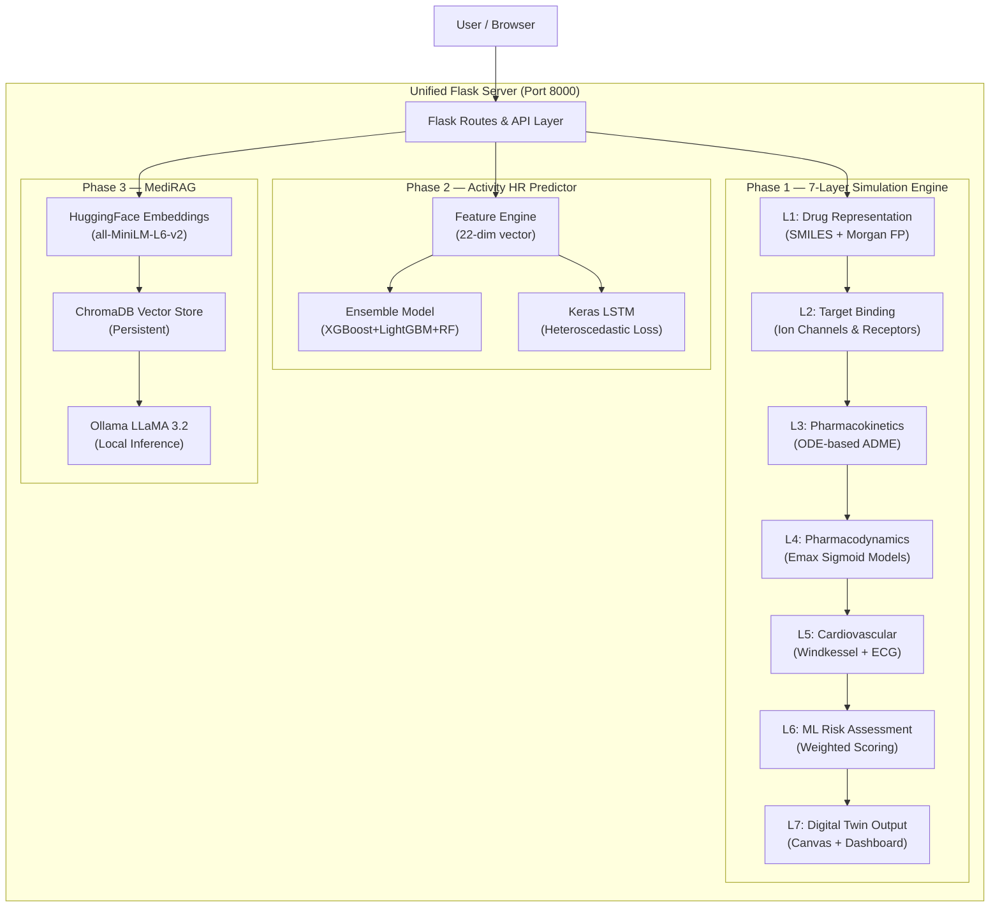
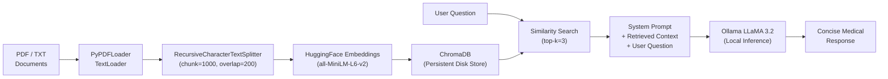
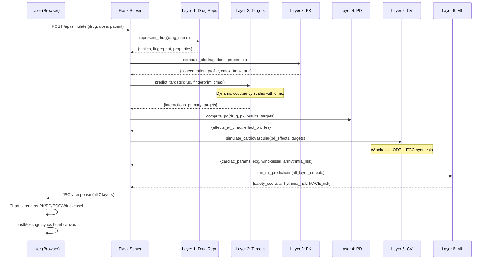

# 🫀 Digital Twin Heart — Complete Technical Project Overview

> **Version**: v2.0 · **Language**: Python 3.9+ / JavaScript (ES6) · **Framework**: Flask + Vanilla JS + Chart.js
> **Repository**: [MSRAM-NEC/Digital-Twin](https://github.com/MSRAM-NEC/Digital-Twin)

---

## 1. Executive Summary

The **Digital Twin Heart** is an integrated, multi-phase medical AI demonstration platform that creates a virtual cardiovascular model of a patient. It simulates how drugs, doses, and patient physiology impact heart function **in real time**, combining:

1. A **7-layer biophysical drug–heart simulation engine** (computational pharmacology)
2. A **polypharmacy combination therapy modeler** (multi-drug interactions)
3. An **activity-driven heart rate prediction pipeline** (ML ensemble + LSTM)
4. A **live wearable metrics dashboard** (smartwatch data)
5. A **RAG-based medical document assistant (MediRAG)** (GenAI / local LLM)

> [!IMPORTANT]
> This project is for **research, demonstration, and educational purposes only** — it is not a clinically calibrated diagnostic tool.

---

## 2. High-Level Architecture



---

## 3. Repository Structure & File Inventory

```
Digital Twin/
├── .env.example                 # Environment variables template (PORT, tokens, Ollama)
├── .gitignore                   # Excludes pycache, .env, chroma_db, logs
├── README.md                    # Primary project documentation (7.6 KB)
├── SEMINAR_TECHNICAL_GUIDE.md   # Viva/presentation preparation guide (8.5 KB)
├── requirements.txt             # Root Python dependencies (32 packages)
│
├── Unified/                     # ★ MAIN INTEGRATED APPLICATION ★
│   ├── unified_app.py           # Flask server — all 4 tabs (446 lines, 20.6 KB)
│   ├── feature_engine.py        # NLP activity → 22-dim feature vector (81 lines)
│   ├── drug_vector.py           # Standalone SMILES → Morgan FP converter (68 lines)
│   ├── config.json              # Patient profile defaults
│   ├── sample_medical_data.txt  # Seed document for MediRAG
│   ├── heart-simulation.html    # Anatomical heart canvas renderer (61 KB)
│   │
│   ├── simulation/              # ★ 7-LAYER BIOPHYSICAL ENGINE ★
│   │   ├── __init__.py
│   │   ├── pipeline.py          # Orchestrator — runs all 7 layers (241 lines)
│   │   ├── drug_representation.py  # L1: SMILES + fingerprint (208 lines)
│   │   ├── drug_target.py       # L2: Receptor binding occupancy (209 lines)
│   │   ├── pharmacokinetics.py  # L3: ODE compartment models (299 lines)
│   │   ├── pharmacodynamics.py  # L4: Sigmoid Emax effects (273 lines)
│   │   ├── cardiovascular.py    # L5: Windkessel + ECG synthesis (338 lines)
│   │   └── ml_predictions.py    # L6: Risk scoring & safety (375 lines)
│   │
│   ├── models/                  # Pre-trained ML model artifacts
│   │   ├── ensemble_model.joblib  # Ensemble (XGB+LGB+RF), ~40 MB
│   │   ├── xgb_model.joblib       # XGBoost standalone
│   │   ├── lgb_model.joblib       # LightGBM standalone
│   │   ├── rf_model.joblib        # Random Forest standalone
│   │   ├── lstm_model.h5          # Keras LSTM (heteroscedastic), 1.6 MB
│   │   ├── scaler.joblib          # StandardScaler for feature normalization
│   │   ├── imputer.joblib         # Missing value imputer
│   │   ├── features_list.joblib   # Feature name ordering
│   │   ├── X_test_scaled.joblib   # Test set (validation)
│   │   └── y_test.joblib          # Test labels (validation)
│   │
│   ├── templates/
│   │   └── index.html           # Glassmorphism dashboard (350 lines, 19.7 KB)
│   │
│   ├── static/
│   │   ├── css/style.css        # Full design system (38 KB)
│   │   └── js/dashboard.js      # Frontend logic + Chart.js rendering (882 lines, 42 KB)
│   │
│   ├── chroma_db/               # Persistent ChromaDB vector database
│   └── data/                    # Document upload storage
│
├── Phase 1/                     # Standalone simulation server (port 5000)
│   ├── app.py                   # Flask app (Phase 1 only)
│   ├── drug_vector.py           # Original SMILES + FP module
│   ├── heart-simulation.html    # Standalone heart canvas
│   ├── simulation/              # Same engine as Unified/simulation/
│   ├── static/ & templates/     # Original Phase 1 frontend
│   └── requirements.txt
│
├── Phase 2/                     # Telegram bot + ML predictor
│   ├── app2.py                  # Telegram bot server (200 lines)
│   ├── drugvector.py            # Drug SMILES with Ollama fallback
│   ├── tracker.py               # User interaction logger
│   ├── config.json              # Patient defaults
│   ├── models/                  # Shared ML model artifacts
│   └── user_interactions.log    # Telegram interaction audit log
│
├── Phase 3/                     # Streamlit RAG chatbot prototype
│   ├── app.py                   # Streamlit app (114 lines)
│   ├── Readme.md                # Phase 3 documentation
│   ├── data/                    # Document storage
│   └── requirements.txt
│
└── data/                        # Root-level data directory (empty)
```

---

## 4. Phase-by-Phase Technical Deep Dive

---

### 4.1 Phase 1 — 7-Layer Biophysical Simulation Engine

The core intellectual contribution. A sequential pipeline that models the complete journey of a drug from ingestion to cardiac effect.

#### Layer 1: Drug Representation ([drug_representation.py](file:///c:/Users/10a32/OneDrive/Desktop/Digital%20Twin/Unified/simulation/drug_representation.py))

| Component | Technical Detail |
|:---|:---|
| **Input** | Drug name string (e.g., `"Metoprolol"`) |
| **SMILES Generation** | 1. Lookup in `DRUG_SMILES_DB` (26 known drugs) → 2. Ollama LLM generation → 3. Deterministic hash-based synthetic SMILES |
| **Fingerprinting** | 1024-bit Morgan circular fingerprint (radius=2) via RDKit `AllChem.GetMorganFingerprintAsBitVect` |
| **Fallback FP** | Deterministic `numpy.RandomState` seeded from MD5 hash of drug name; density ~5–15% |
| **Properties** | Molecular Weight (MW), LogP, TPSA, HBD, HBA, drug category, half-life |
| **Output** | `dict` with `smiles`, `fingerprint` (1024-element list), `properties`, `fingerprint_density`, `n_bits_on` |

**Key algorithms:**
- `_hash_seed(name)` → MD5 hash truncated to 8 hex chars → integer seed for reproducibility
- RDKit validation: `Chem.MolFromSmiles(smiles)` returns `None` if invalid

---

#### Layer 2: Drug-Target Interaction ([drug_target.py](file:///c:/Users/10a32/OneDrive/Desktop/Digital%20Twin/Unified/simulation/drug_target.py))

Models binding affinity to **11 cardiac-relevant protein targets**:

| Target | Full Name | Physiological Role |
|:---|:---|:---|
| **hERG** | hERG Potassium Channel | Cardiac repolarization; blockade → QT prolongation |
| **Nav1.5** | Cardiac Sodium Channel | Depolarization & conduction velocity |
| **Cav1.2** | L-type Calcium Channel | Contraction & vascular smooth muscle tone |
| **Beta1** | β₁-Adrenergic Receptor | Heart rate & contractility (sympathetic) |
| **Beta2** | β₂-Adrenergic Receptor | Bronchodilation & vasodilation |
| **Alpha1** | α₁-Adrenergic Receptor | Vascular smooth muscle contraction |
| **ACE** | Angiotensin Converting Enzyme | BP regulation via angiotensin conversion |
| **AT1** | Angiotensin II Type 1 Receptor | Vasoconstriction & aldosterone release |
| **COX1** | Cyclooxygenase-1 | Platelet aggregation (thromboxane A₂) |
| **NaK_ATPase** | Na⁺/K⁺ ATPase | Ion gradient → intracellular Ca²⁺ |
| **PDE3** | Phosphodiesterase 3 | cAMP degradation → contractility |

**Binding prediction method:**
1. **Known interactions**: `KNOWN_INTERACTIONS` dict maps 20 drugs to experimentally-sourced affinity values (0.0–1.0)
2. **Predicted interactions**: Bilinear drug–protein interaction model:
   - Generate 128-dim protein embedding from seeded `RandomState`
   - Down-project 1024-dim drug fingerprint via random weight matrix `W ∈ ℝ^{128×1024}`
   - Bilinear score = `dot(W @ drug_fp, protein_embed)`
   - Sigmoid activation → score ∈ [0, 1], scaled by 0.3

3. **Dynamic occupancy** (Hill equation analog):
   ```
   EC50_target = max(0.01, 1.0 − intrinsic_affinity) × 2.0
   occupancy = (C_eff / (EC50 + C_eff)) × intrinsic_affinity
   ```
   This makes binding **dose-dependent** — higher doses produce higher occupancy.

**Polypharmacy combination** (in [pipeline.py](file:///c:/Users/10a32/OneDrive/Desktop/Digital%20Twin/Unified/simulation/pipeline.py)):
```
Occupancy_combined = 1 − (1 − p₁)(1 − p₂)     # for hERG, Nav1.5, Cav1.2
```

---

#### Layer 3: Pharmacokinetics — ADME ([pharmacokinetics.py](file:///c:/Users/10a32/OneDrive/Desktop/Digital%20Twin/Unified/simulation/pharmacokinetics.py))

Models **Absorption, Distribution, Metabolism, and Excretion** via compartmental ODE models.

**One-Compartment Model (oral absorption):**
```
C(t) = (F × D × ka) / (Vd × (ka − ke)) × (e^(−ke·t) − e^(−ka·t))
```
Where: F = bioavailability, D = dose, ka = absorption rate, ke = elimination rate, Vd = volume of distribution

**Two-Compartment Model (tissue distribution):**
```
dA_gut/dt      = −ka × A_gut
dA_central/dt  = ka × A_gut − ke × A_central − k₁₂ × A_central + k₂₁ × A_periph
dA_periph/dt   = k₁₂ × A_central − k₂₁ × A_periph
```
Solved using `scipy.integrate.solve_ivp` with **BDF (Backward Differentiation Formula)** stiff solver.

| PK Parameter | Stored For | Source |
|:---|:---|:---|
| Bioavailability (F) | 18 known drugs | Clinical literature |
| Volume of Distribution (Vd) | 18 known drugs | Clinical literature |
| Clearance (CL) | 18 known drugs | Clinical literature |
| Absorption Rate (ka) | 18 known drugs | Clinical literature |
| Protein Binding | 18 known drugs | Clinical literature |
| Half-life (t½) | 18 known drugs | Clinical literature |

**For unknown drugs**, PK parameters are estimated from physicochemical properties using rule-of-thumb equations based on MW, LogP, and TPSA.

**Patient physiology modifiers:**
- `eGFR` scales renal clearance: `clearance_factor = max(0.2, min(2.0, eGFR / 90.0))`
- Renal impairment flag: additional 0.65× clearance penalty

**Key outputs:** C_max (μg/mL), T_max (hours), AUC (μg·hr/mL), full concentration–time curves (500 points)

---

#### Layer 4: Pharmacodynamics ([pharmacodynamics.py](file:///c:/Users/10a32/OneDrive/Desktop/Digital%20Twin/Unified/simulation/pharmacodynamics.py))

Maps drug concentration to physiological effect using the **Sigmoid E_max model**:

```
E = baseline + E_max × C^n / (EC50^n + C^n) + off_target_toxicity
```

**Off-target toxicity mechanic** (supramaximal overdose):
When plasma concentration exceeds 3× EC50, unbounded linear toxicity bleeds:
```python
if C > EC50 × 3.0:
    excess = C − EC50 × 3.0
    tox_slope = (E_max × 0.15) / EC50
    effect += tox_slope × excess
```
This prevents effect from plateauing perfectly — severe overdoses cause runaway effects.

**5 cardiac parameters modeled:**

| Parameter | Baseline | Example Drug Effect (Metoprolol) |
|:---|:---|:---|
| Heart Rate | 72 bpm | E_max = −25 (reduces HR) |
| Systolic BP | 120 mmHg | E_max = −15 (lowers BP) |
| Diastolic BP | 80 mmHg | E_max = −10 |
| Contractility | 100% | E_max = −15 (negative inotropy) |
| QT Interval | 400 ms | E_max = +5 (mild prolongation) |

Pre-configured PD parameters exist for **11 drugs**. For unknown drugs, PD effects are auto-generated from target interaction strengths.

**Hypokalemia sensitivity** (in pipeline.py):
If serum K⁺ < 3.5 mM → arrhythmia risk is escalated by one tier (low → moderate → high).

---

#### Layer 5: Cardiovascular System ([cardiovascular.py](file:///c:/Users/10a32/OneDrive/Desktop/Digital%20Twin/Unified/simulation/cardiovascular.py))

##### 5a. Windkessel Arterial Pressure Model
3-element Windkessel model using ODE solver:
```
dP/dt = (Q_in − P/R) / C
```
Where: P = arterial pressure, Q_in = pulsatile cardiac flow (sinusoidal ejection), R = peripheral resistance, C = arterial compliance.

Solved with `solve_ivp` (RK45 method, max_step=0.001s). Outputs systolic, diastolic, MAP, and pulse pressure waveforms.

##### 5b. Synthetic ECG Waveform Generation
Generates Lead II ECG approximation by superimposing Gaussian-modeled waveform components:
- **P wave**: atrial depolarization (amplitude 0.15 mV, width 40 ms)
- **QRS complex**: Q wave (−0.1 mV), R wave (+1.2 mV), S wave (−0.25 mV)
- **T wave**: ventricular repolarization (amplitude 0.3 mV, position scaled by QT interval)

**QTc correction** (Bazett's formula):
```
QTc = QT / √(RR interval in seconds)
```

##### 5c. Cardiac Output Computation
```
CO = HR × SV / 1000   (L/min)
```
Includes Frank-Starling compensation and filling-time penalty at extreme heart rates. Organ perfusion is distributed: brain 15%, kidneys 22%, liver 25%, skeletal muscle 20%.

##### 5d. Arrhythmia Risk Estimation
Combined probabilistic model:
```
total_risk = QT_risk + ion_channel_risk × (1 − QT_risk)
```
- QT risk tiers: QTc > 500 → 0.8, > 480 → 0.5, > 460 → 0.25, > 440 → 0.1, else 0.02
- Ion channel risk: `0.3 × hERG + 0.15 × Nav1.5 + 0.1 × Cav1.2`
- Torsades de Pointes (TdP) risk = total_risk × 0.3

---

#### Layer 6: ML Risk Assessment ([ml_predictions.py](file:///c:/Users/10a32/OneDrive/Desktop/Digital%20Twin/Unified/simulation/ml_predictions.py))

Extracts **33 features** from all prior layers and runs 5 prediction models:

| Prediction | Method | Key Features |
|:---|:---|:---|
| **Arrhythmia Risk** | Weighted logistic model + sigmoid | hERG binding (30%), QTc (15%), Nav1.5 (15%), age, comorbidities |
| **Cardiac Event (MACE)** | Weighted logistic model | Age, comorbidities, contractility change, CO, EF |
| **BP Response** | Rule-based categorization | SBP change thresholds: >20 strong, >10 moderate, >5 mild |
| **Treatment Effectiveness** | Category-specific scoring | Drug category → specific scoring (β-blocker: Beta1 binding + HR reduction) |
| **Drug Safety Score** | Demerit system (10 − demerits) | hERG liability (3 pts), QT prolongation (3 pts), BP instability (1.5 pts), contractility (2 pts) |

**Safety Classification:**
- ≥ 8.0: **Safe** (🟢)
- ≥ 6.0: **Caution** (🟡)
- ≥ 4.0: **Warning** (🟠)
- < 4.0: **Dangerous** (🔴)

---

#### Layer 7: Digital Twin Visualization

The final output layer combines all simulation data into a structured JSON response rendered by the frontend:

- **Summary stat cards**: HR, BP, QTc, Safety Score
- **Interactive charts** (Chart.js): PK concentration curves, PD effect profiles, ECG waveforms, Windkessel pressure waveforms
- **Target interaction table**: Binding strength bars with color-coded significance
- **ADME flow diagram**: Visual absorption → distribution → metabolism → excretion pipeline
- **Organ perfusion grid**: Brain, heart, kidneys, liver, muscle distribution
- **Heart canvas** (iframe): Anatomical HTML5 canvas heart with real-time contraction animation synced via `postMessage` API
- **Export**: One-click JSON report download

---

### 4.2 Phase 2 — Activity Heart Rate Prediction

#### Feature Engineering ([feature_engine.py](file:///c:/Users/10a32/OneDrive/Desktop/Digital%20Twin/Unified/feature_engine.py))

Natural language activity prompts → 22-dimensional feature vector:

| Index | Feature | Source |
|:---|:---|:---|
| 0 | Age | Patient config |
| 1 | Height (cm) | Patient config |
| 2 | Weight (kg) | Patient config |
| 3 | Resting HR | Patient config |
| 4 | Activity intensity (0.0–0.8) | Keyword classification |
| 5 | Duration (minutes) | Regex extraction from query |
| 6–20 | One-hot activity encoding | `sum(ord(c)) % 15` hash position |
| 21 | (padding) | Zero |

**Activity classification**: Keyword spotting over 12 activities (run, swim, walk, sleep, chess, gym, workout, cycling, bike) with intensity and base HR mappings.

**Heart rate estimation** (Karvonen Formula):
```
Target HR = Resting HR + Intensity × (HR_max − Resting HR)
HR_max = 220 − Age
```

#### ML Model Stack

| Model | Type | File | Size |
|:---|:---|:---|:---|
| XGBoost Regressor | Gradient Boosted Trees | `xgb_model.joblib` | 580 KB |
| LightGBM Regressor | Gradient Boosted Trees | `lgb_model.joblib` | 440 KB |
| Random Forest Regressor | Bagged Decision Trees | `rf_model.joblib` | 4.2 MB |
| **Ensemble** | Weighted average of above | `ensemble_model.joblib` | 40.8 MB |
| **LSTM** | Keras Sequential RNN | `lstm_model.h5` | 1.6 MB |
| StandardScaler | Feature normalization | `scaler.joblib` | 855 B |

**LSTM architecture**: 10-step sequence model with **heteroscedastic loss**:
```
L = (1/2) × [(y − ŷ)² / σ² + ln(σ²)]
```
The model outputs **both** predicted mean HR and predicted variance, capturing epistemic uncertainty.

**Prediction flow:**
1. Build 22-dim feature vector from query + patient config
2. Scale features using StandardScaler
3. Ensemble: `scaler.transform([features])` → `model.predict()`
4. LSTM: Tile scaled features into (1, 10, 22) sequence → `model.predict()`
5. LLM insight: Send prediction to Ollama LLaMA 3.2 for natural language response

#### Telegram Bot Integration ([app2.py](file:///c:/Users/10a32/OneDrive/Desktop/Digital%20Twin/Phase%202/app2.py))

- Uses `python-telegram-bot` library (async, v20+)
- Commands: `/start`, `/help`
- Message handler: Any text → activity classification → ML prediction → Ollama response
- User interaction logging via [tracker.py](file:///c:/Users/10a32/OneDrive/Desktop/Digital%20Twin/Phase%202/tracker.py) (file + console)
- Uses `nest_asyncio` for event loop compatibility

---

### 4.3 Phase 3 — MediRAG (Medical Retrieval-Augmented Generation)

#### RAG Pipeline Architecture



| Component | Technology | Detail |
|:---|:---|:---|
| **Document Loaders** | LangChain `PyPDFLoader`, `TextLoader` | Supports PDF and UTF-8 TXT |
| **Text Splitter** | `RecursiveCharacterTextSplitter` | chunk_size=1000, chunk_overlap=200 |
| **Embeddings** | `sentence-transformers/all-MiniLM-L6-v2` | 384-dim sentence embeddings |
| **Vector Store** | ChromaDB | Persistent disk storage at `./chroma_db` |
| **LLM** | Ollama LLaMA 3.2 | Local HTTP API at `http://127.0.0.1:11434` |
| **Retriever** | Chroma `.as_retriever(k=3)` | Top-3 similarity search |

#### Three-Tier Response Strategy (in [unified_app.py](file:///c:/Users/10a32/OneDrive/Desktop/Digital%20Twin/Unified/unified_app.py))

1. **Direct Ollama HTTP** → `urllib.request` to `/api/generate` (fastest, no wrapper overhead)
2. **LangChain chain fallback** → `create_retrieval_chain` + `create_stuff_documents_chain` (full RAG chain)
3. **Rule-based fallback** → Structured template response (when Ollama is completely offline)

#### Auto-Document Loading
On startup, automatically ingests:
- All `.pdf`/`.txt` files from `Unified/data/`
- `Unified/sample_medical_data.txt` (drug profiles, emergency thresholds, ML documentation)

#### Standalone Phase 3 ([Phase 3/app.py](file:///c:/Users/10a32/OneDrive/Desktop/Digital%20Twin/Phase%203/app.py))
- **Streamlit** web interface with sidebar file upload
- Session-state managed vector store (in-memory, not persistent)
- Chat history with `st.chat_message` components

---

## 5. Unified Application Server

The [unified_app.py](file:///c:/Users/10a32/OneDrive/Desktop/Digital%20Twin/Unified/unified_app.py) consolidates all 3 phases into a single Flask server (port 8000).

### REST API Reference

| Endpoint | Method | Phase | Description |
|:---|:---|:---|:---|
| `/` | GET | — | Main Glassmorphism dashboard UI |
| `/heart` | GET | 1 | Serves anatomical heart HTML5 canvas |
| `/api/drugs` | GET | 1 | Returns catalog of 21 pre-configured drugs |
| `/api/simulate` | POST | 1 | Runs complete 7-layer simulation (supports polypharmacy) |
| `/api/heart-params` | GET | 1 | Returns current cardiac state for heart canvas sync |
| `/api/chat-activity` | POST | 2 | NLP activity → ML heart rate prediction + LLM insight |
| `/api/ollama/status` | GET | — | Checks Ollama connection and lists available models |
| `/api/rag/upload` | POST | 3 | Ingests PDF/TXT into persistent ChromaDB vector store |
| `/api/rag/chat` | POST | 3 | RAG query over uploaded medical documents |

### Simulation API Request Schema (`POST /api/simulate`)

```json
{
    "drug_name": "Metoprolol",
    "dose_mg": 50,
    "secondary_drug_name": "Amlodipine",
    "secondary_dose_mg": 5,
    "t_max_hours": 48,
    "age": 45,
    "weight_kg": 70,
    "sex": "male",
    "heart_disease": false,
    "hypertension": true,
    "diabetes": false,
    "renal_impairment": false,
    "egfr": 90.0,
    "potassium_mM": 4.0,
    "baseline_qtc_ms": 410.0
}
```

### Simulation Response Structure

```json
{
    "status": "success",
    "data": {
        "simulation_info": { "drug_name", "dose_mg", "polypharmacy_active", "patient", "layer_times", "total_computation_time_seconds" },
        "layer_1_drug_representation": { "smiles", "properties", "fingerprint_density", "n_bits_on" },
        "layer_2_drug_target": { "interactions", "primary_targets", "secondary_targets", "selectivity_index" },
        "layer_3_pharmacokinetics": { "pk_parameters", "adme", "concentration_profile", "two_compartment", "cmax", "tmax", "auc" },
        "layer_4_pharmacodynamics": { "effects_at_cmax", "effect_profiles", "arrhythmia_risk_from_qt" },
        "layer_5_cardiovascular": { "cardiac_parameters", "windkessel", "ecg", "cardiac_output", "arrhythmia_risk", "warnings" },
        "layer_6_ml_predictions": { "arrhythmia_risk", "cardiac_event_risk", "bp_response", "treatment_effectiveness", "drug_safety" }
    }
}
```

---

## 6. Frontend Architecture

### Technology Stack

| Component | Technology |
|:---|:---|
| **Layout** | Semantic HTML5, Glassmorphism CSS design system |
| **Typography** | Google Fonts: Inter (300–700) + Outfit (400–700) |
| **Charting** | Chart.js v4.4.0 (line, bar, donut charts) |
| **Heart Visualization** | HTML5 Canvas (embedded via iframe, synced via `postMessage`) |
| **CSS** | Custom design tokens, CSS variables, no framework (~38 KB) |
| **JavaScript** | Vanilla ES6+ (~42 KB, 882 lines) |

### Dashboard Tabs

| Tab | Content |
|:---|:---|
| **🧬 Drug Sim** | Full 7-layer simulation with input panel, pipeline strip animation, results grid |
| **💓 Heart Viz** | Iframe-embedded anatomical heart canvas with real-time cardiac parameter sync |
| **🏃 Activity HR** | NLP activity input → ML ensemble + LSTM prediction → Ollama AI insight |
| **🤖 MediRAG** | Document upload (PDF/TXT) + chat interface with RAG-powered responses |

### Key UI Components

- **Pipeline strip**: Animated 7-node visualization showing simulation progress
- **Drug picker**: Floating panel with search, category tabs, and drug cards
- **Summary stat cards**: HR, BP, QTc, Safety Score with dynamic color-coding
- **Chart panels**: PK curves (1-compartment + 2-compartment), PD effect timelines, ECG waveform, Windkessel pressure
- **Target interaction table**: Binding strength progress bars with color coding
- **ADME flow diagram**: Visual absorption → distribution → metabolism → excretion
- **Organ perfusion grid**: Brain, heart, kidneys, liver, muscle, skin distribution
- **Safety meter**: Circular gauge with score and classification
- **Loading overlay**: Animated heart pulsation with layer-by-layer progress text
- **Ollama status pill**: Real-time connection indicator (green/amber/red)

---

## 7. Drug Database

The system includes a catalog of **21 cardiovascular drugs** across 11 categories:

| Category | Drugs | Key Target |
|:---|:---|:---|
| **Beta Blockers** | Metoprolol, Propranolol, Atenolol | β₁ receptor |
| **CCBs** | Amlodipine, Verapamil, Diltiazem, Nifedipine | Cav1.2 channel |
| **ACE Inhibitors** | Lisinopril, Captopril, Enalapril | ACE enzyme |
| **ARBs** | Losartan | AT₁ receptor |
| **Antiarrhythmics** | Amiodarone, Sotalol | hERG + multi-channel |
| **Cardiac Glycosides** | Digoxin | Na⁺/K⁺ ATPase |
| **Anticoagulants** | Warfarin | (minimal cardiac) |
| **Antiplatelets** | Aspirin | COX-1 |
| **Diuretics** | Furosemide | (minimal cardiac) |
| **Cardiotoxic** | Doxorubicin | hERG + Cav1.2 |
| **Stimulants** | Caffeine | PDE3 + β₁/β₂ |
| **NSAIDs** | Ibuprofen | COX-1 |
| **Analgesics** | Acetaminophen | COX-1 (weak) |

Each drug has pre-configured:
- SMILES string (in `DRUG_SMILES_DB`)
- Physicochemical properties (MW, LogP, TPSA, HBD, HBA, half-life)
- PK parameters (bioavailability, Vd, clearance, ka, protein binding)
- PD parameters (E_max, EC50, Hill coefficient for 5 cardiac parameters)
- Target interactions (binding affinities for 11 protein targets)

---

## 8. Fault-Tolerant Fallback Architecture

The system is designed to **never crash** even when optional dependencies are missing:

| Dependency | If Present | If Missing (Fallback) |
|:---|:---|:---|
| **RDKit** | Real Morgan fingerprints from SMILES | Deterministic hash-based binary vector |
| **Ollama** | LLM-powered insights & MediRAG chat | Rule-based structured text responses |
| **TensorFlow** | LSTM heart rate prediction | Karvonen formula estimate + offset |
| **scikit-learn/XGBoost/LightGBM** | Trained ensemble prediction | Karvonen formula estimate + offset |
| **LangChain + ChromaDB** | Full RAG pipeline | Direct Ollama HTTP → rule-based fallback |
| **python-telegram-bot** | Telegram bot integration | Graceful skip with warning message |
| **Wearable API** | Live smartwatch data | Pre-loaded mock JSON metrics |

All imports use `try/except ImportError` patterns with boolean flags (`RDKIT_AVAILABLE`, `LANGCHAIN_AVAILABLE`, `TF_AVAILABLE`, `TELEGRAM_AVAILABLE`).

---

## 9. Mathematical Models Summary

| Model | Equation | Used In |
|:---|:---|:---|
| **One-Compartment PK** | `C(t) = (F·D·ka)/(Vd·(ka−ke)) × (e^(−ke·t) − e^(−ka·t))` | Layer 3 |
| **Two-Compartment ODE** | 3-state ODE system (gut, central, peripheral) | Layer 3 |
| **Hill Equation (occupancy)** | `Occ = (C_eff/(EC50+C_eff)) × affinity` | Layer 2 |
| **Sigmoid E_max** | `E = baseline + E_max × C^n / (EC50^n + C^n)` | Layer 4 |
| **Windkessel ODE** | `dP/dt = (Q_in − P/R) / C` | Layer 5 |
| **Bazett's QTc** | `QTc = QT / √(RR)` | Layer 5 |
| **Karvonen HR** | `Target = Resting + Intensity × (HR_max − Resting)` | Phase 2 |
| **Heteroscedastic Loss** | `L = ½[(y−ŷ)²/σ² + ln(σ²)]` | Phase 2 LSTM |
| **Polypharmacy Occupancy** | `Occ_combined = 1 − (1−p₁)(1−p₂)` | Layer 2 |
| **Cardiac Output** | `CO = HR × SV / 1000` | Layer 5 |

---

## 10. Technology Stack Summary

| Layer | Technologies |
|:---|:---|
| **Backend** | Python 3.9+, Flask ≥2.0, SciPy (solve_ivp), NumPy, Pandas |
| **ML/DL** | scikit-learn, XGBoost, LightGBM, TensorFlow/Keras, joblib |
| **Chemistry** | RDKit (optional), Ollama LLM (SMILES generation) |
| **GenAI / LLM** | Ollama (local), LLaMA 3.2, LangChain, HuggingFace Transformers |
| **Vector DB** | ChromaDB (persistent disk store) |
| **Embeddings** | `sentence-transformers/all-MiniLM-L6-v2` (384-dim) |
| **Frontend** | HTML5, Vanilla CSS (Glassmorphism), Vanilla JS (ES6+), Chart.js v4 |
| **Bot** | python-telegram-bot v20+ (async), nest_asyncio |
| **DevOps** | Git, .env configuration, pip |

---

## 11. Data Flow Diagram — Full Simulation



---

## 12. Key Design Decisions

| Decision | Rationale |
|:---|:---|
| **7-layer sequential pipeline** | Mirrors real pharmacological cascade: ingestion → absorption → distribution → effect → cardiac impact → risk assessment |
| **ODE solvers (SciPy)** | Physically accurate compartmental models vs. lookup tables |
| **Deterministic fallbacks** | Hash-based reproducibility ensures consistent results without optional dependencies |
| **Local-only LLM (Ollama)** | No patient data leaves the machine — privacy by design |
| **ChromaDB persistent store** | Documents survive server restarts; no re-ingestion needed |
| **Three-tier LLM fallback** | Direct HTTP → LangChain chain → rule-based: maximizes availability |
| **Heteroscedastic LSTM loss** | Captures aleatoric uncertainty in noisy fitness data |
| **Polypharmacy via probabilistic combination** | Standard independence assumption for additive ion channel blockade |
| **Supramaximal overdose toxicity** | Prevents unrealistic E_max saturation at extreme doses |
| **Glassmorphism UI** | Modern, premium aesthetic with frosted-glass cards and subtle animations |

---

## 13. External Service Dependencies

| Service | URL | Purpose | Required? |
|:---|:---|:---|:---|
| **Ollama** | `http://127.0.0.1:11434` | Local LLM (LLaMA 3.2) | Optional (rule-based fallback) |
| **Wearable API** | `https://app-eks.gonoise.com` | Live smartwatch metrics | Optional (mock data fallback) |
| **Google Fonts** | CDN | Inter + Outfit typography | Optional (browser defaults) |
| **Chart.js** | CDN | Frontend charting | Required |

---

## 14. Running the Project

```bash
# 1. Clone
git clone https://github.com/MSRAM-NEC/Digital-Twin.git
cd Digital-Twin

# 2. Install dependencies
pip install -r requirements.txt

# 3. (Optional) Set up Ollama for AI features
ollama pull llama3.2

# 4. (Optional) Configure environment
cp .env.example .env

# 5. Launch unified server
cd Unified
python unified_app.py

# Server starts at http://127.0.0.1:8000
```

---

> **Total codebase**: ~3,500 lines of Python backend + ~1,230 lines of frontend (HTML + JS + CSS) across 25+ source files
> **Pre-trained model artifacts**: ~47 MB (ensemble + LSTM + scalers)
> **Supported drugs**: 21 pre-configured + unlimited via LLM/hash fallback
> **Protein targets**: 11 cardiac-relevant receptors and ion channels
